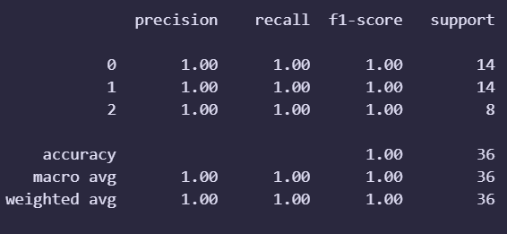

# Machine Learning Algorithms - Playground

This repositories includes the jupyter notebooks I made learning the common machine learning algorithms.

Which are:

- K-Nearest Neighbors Classifier

## K-Nearest Neighbors Classifier

KNN is a supervised learning algorithm which determines the class of a datapoint by looking at the majority class among it's 'k' neighbors.

KNN works by:
1. Choose a value for K
2. Compute distance between the chosen point and others
3. Select k closest data points
4. Perform a majority vote to find the most common class among them
5. Assign the resultant class to the chosen point

### Use of StandardScaler

KNN is a distance based algorithm, as such, datapoints located at large distances may disproportionately influence the calculations. To avoid this, Scaling the features is necessary.

StandardScaler works by scaling the data to have a mean of 0 and a variance of 1. This makes sure that all features contribute equally to distance calculations, thus enabling the model to make more reliable predictions and better generalization to unseen data.

Using GridCV, I found the best parameter for the data in range of 100 is **75**

Results obtained:
