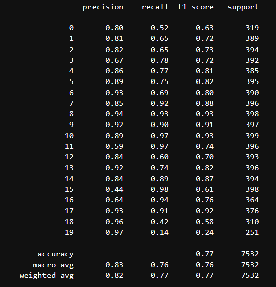
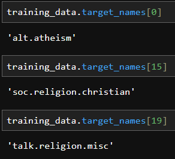
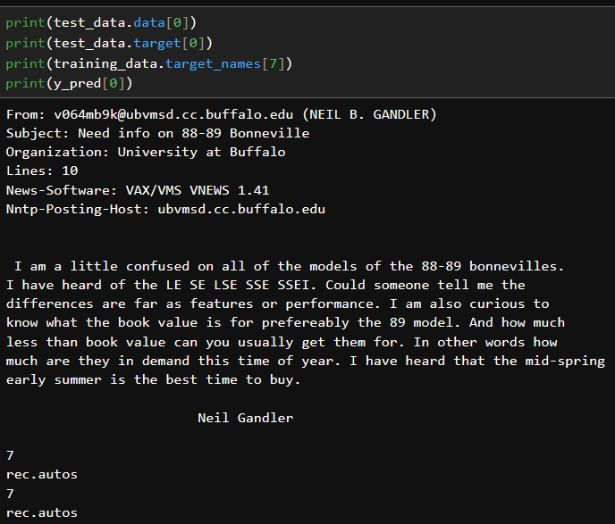
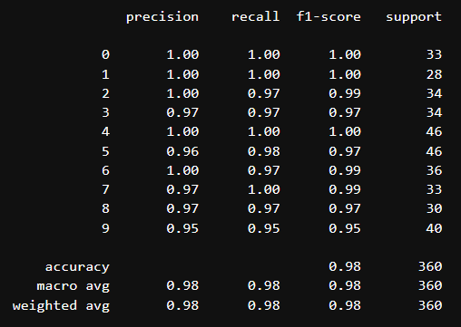

# Machine Learning Algorithms - Playground

This repositories includes the jupyter notebooks I made while learning the common machine learning algorithms.

Which are:

- K-Nearest Neighbors Classifier
- Naive Bayes Classifier
- ...

## K-Nearest Neighbors Classifier

KNN is a supervised learning algorithm which determines the class of a datapoint by looking at the majority class among it's 'k' neighbors.

KNN works by:
1. Choose a value for K
2. Compute distance between the chosen point and others
3. Select k closest data points
4. Perform a majority vote to find the most common class among them
5. Assign the resultant class to the chosen point

### Use of StandardScaler

KNN is a distance based algorithm, as such, datapoints located at large distances may disproportionately influence the calculations. To avoid this, Scaling the features is necessary.

StandardScaler works by scaling the data to have a mean of 0 and a variance of 1. This makes sure that all features contribute equally to distance calculations, thus enabling the model to make more reliable predictions and better generalization to unseen data.

Using GridCV, I found the best parameter for the data in range of 100 is **75**

### Results
Results obtained:

## Naive Bayes Classifier

A supervised learning algorithm based on the Bayes Theorem (Probability), with the 'naive' assumption that all features are independent of each other. This algorithm, eventhough seems to be inaccurate, actually performs really well for high dimensional data in practice.
> The importance of irrelevant features will be really low because each feature is evaluated independently.
> Also, since this avoids complex calculations to form feature interactions, it has high computational efficiency.

Core Idea is to calculate the probability of each class for a given input and pick the class with the highest probability.

$$P(X|y) = \prod_{i=1}^{n} P(x_i | y)$$

^ This is the naive assumption.

### TF-IDF
TF stands for Text Frequency: How many times the word appeared in a specific document.
IDF stands for Inverse Document Frequency: It is a score for how rare a word is across all the documents (rarer->higher score).

A TF-IDF Vectorizer (*TFidFVectorizer from Scikit-learn*) creates a matrix for extracted words from documents where:
- Each row represents a document
- Each column represents a word (from the vocabulary)
- Value in each cell is the TF-IDF score (Product of TF and IDF)

### Results

> The three classes below obtained bad results - because words like "God" "faith" are all commonly used in them, yet since naive bayes assumes independence, no relation is found between them.

> An example classification:

## Support Vector Classifiction
A non linear supervised learning algorithm which basically uses a hyperplane to seperate datapoints into multiple classes.

This 'hyperplane' is chosen in a way to maximize the margin of decision boundary. It uses a linear combination equation that looks similar to linear regression but only the datapoints at the margins (aka the support vectors) influence the hyperplane.
$$W.X + b = 0$$

Two types of SVM classifiers exist, Hard Margin which is the one I was referring to earlier and Soft Margin which not only optimize to maximize the margin but also allows keeping a number of misclassifications possible, thus making it more suitable for real world imperfect data. This optimization is done using Lagrange multipliers.

### Kernel Trick!
What if data points are in concentric circles? No single line/plane can seperate it like that.

The approach to solve this is by projecting the dataset to a higher dimension, thus making the datapoints linearly seperable.

A kernel function can calculate the dot product of the vectors in this new high dimensional space without actually transforming the data.

This allows us to find complex boundaries efficiently.

### Results

Classification report of the State Vector Classifier trained on 8 bit digits.

An example error that occured:

